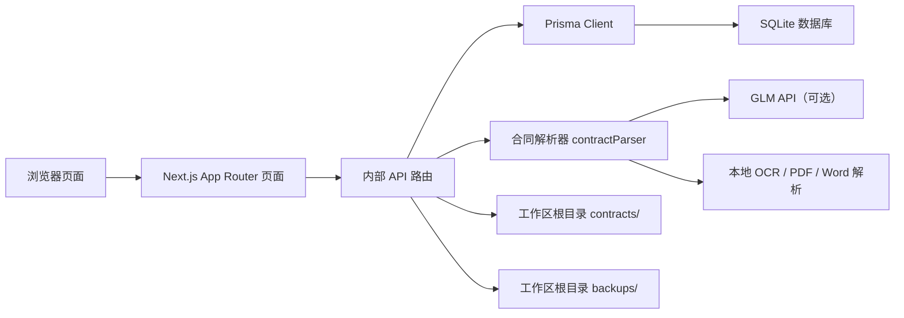

# 当前实现架构说明

本文档描述的是仓库当前已经落地的实现，不是目标蓝图。

## 1. 系统定位

当前系统是一个单用户、本地部署的工程检测业务后台，核心目标是把以下几类数据串起来：

- 合同与价格清单
- 每日工作记录
- 人员与项目主数据
- 自动计算出的人员产值
- 月度汇总报表

## 2. 总体架构

## 3. 目录边界

容易混淆的地方在于本仓库是“双层目录”：

- 工作区根目录
  - 放文档、合同存档、备份、测试样例
- `src/`
  - 放实际运行的 Next.js 应用

运行时数据目录：

- `contracts/`
  - 上传后的合同文件
- `backups/`
  - SQLite 快照

应用核心目录：

- `src/src/app/`
  - 页面和 API
- `src/src/lib/`
  - 业务库
- `src/prisma/`
  - Prisma schema 和 SQLite 数据文件

## 4. 核心模块

### 4.1 页面层

- 仪表盘 `/`
  - 汇总统计
  - 近期工作记录
  - 本月人员产值排行
  - 备份列表
- 工作记录 `/worklog`
  - 接收 WPS 粘贴文本
  - 展示解析结果
  - 编辑、删除工作记录
- 合同管理 `/contracts`
  - 上传合同文件
  - 自动识别基础信息和价格清单
  - 人工确认后入库
- 报表 `/reports`
  - 按人员或项目汇总
  - 导出 Excel
- 主数据 `/master/*`
  - 人员
  - 项目
  - 内部指导价

### 4.2 API 层

API 全部位于 `src/src/app/api/`，是内部页面直接调用的无鉴权接口。

主要能力：

- `staff`
- `projects`
- `prices`
- `contracts`
- `worklog`
- `reports`
- `export`
- `upload`
- `backup`

详细参数见 [api_reference.md](api_reference.md)。

### 4.3 业务库层

- `prisma.js`
  - Prisma 单例
- `wpsParser.js`
  - 解析 WPS / Excel 粘贴文本
- `productionCalculator.js`
  - 根据合同价或内部价生成产值记录
- `contractParser.js`
  - 合同文件解析入口
  - 优先走 GLM
  - 否则降级到本地 OCR / 文本提取 / 规则解析

## 5. 关键业务流程

### 5.1 工作日志导入流程

1. 用户在 `/worklog` 粘贴 WPS 表格文本
2. 页面调用 `POST /api/worklog`
3. API 调用 `parseWPSText(rawText)`
4. 每一行解析结果会：
   - 自动查找或创建项目
   - 自动查找或创建人员
   - 创建 `WorkLog`
   - 创建 `WorkLogStaff`
5. 调用 `calculateProductionValue(workLog, staffIds)`
6. 生成 `ProductionValue`

### 5.2 合同导入流程

1. 用户在 `/contracts` 上传 PDF / DOC / DOCX / PNG / JPG
2. `POST /api/upload` 将文件保存到工作区根目录 `contracts/`
3. 调用 `parseContract`
4. `contractParser` 优先使用：
   - GLM 文本 / 视觉模型
5. 如果未配置 GLM 或识别失败，则降级到：
   - `pdf-parse`
   - `mammoth`
   - `word-extractor`
   - `tesseract.js`
   - 本地正则规则提取
6. 页面展示识别结果
7. 用户确认后，调用 `POST /api/contracts` 入库

### 5.3 产值计算流程

当前实现逻辑：

1. 如果工作记录所属项目已关联合同，则优先查合同单价
2. 否则查内部指导价
3. 产值 = 单价 x 数量
4. 多人参与时，平均分配给每个人

当前匹配规则比较严格：

- 直接用 `workLog.testContent` 精确匹配 `priceItem.testItemName`
- 如果未命中，再精确匹配 `internalPrice.testItemName`

### 5.4 报表与导出流程

1. `GET /api/reports`
   - 按人员或项目聚合 `ProductionValue`
2. `GET /api/export`
   - 生成 Excel
   - 支持汇总和明细

### 5.5 备份流程

1. 页面调用 `POST /api/backup`
2. API 复制当前 SQLite 文件
3. 快照保存到工作区根目录 `backups/`
4. `GET /api/backup` 返回备份列表
5. `GET /api/backup?name=...` 下载历史快照

## 6. 数据模型

### 6.1 实体

| 模型 | 用途 |
| :--- | :--- |
| `Staff` | 人员主数据 |
| `Project` | 项目主数据 |
| `Contract` | 合同主数据 |
| `PriceItem` | 合同价格清单 |
| `InternalPrice` | 内部指导价 |
| `WorkLog` | 工作记录 |
| `WorkLogStaff` | 工作记录与人员的多对多关系 |
| `ProductionValue` | 产值分摊结果 |

### 6.2 关系

- 一个 `Contract` 可以关联多个 `Project`
- 一个 `Contract` 可以有多个 `PriceItem`
- 一个 `Project` 可以有多条 `WorkLog`
- 一条 `WorkLog` 可以对应多个 `Staff`
- 一条 `WorkLog` 对每个参与人员生成一条 `ProductionValue`

## 7. 环境与存储

### 7.1 数据库

- 使用 Prisma + SQLite
- `DATABASE_URL` 当前默认写法为 `file:./dev.db`
- 由于该路径相对 `prisma/schema.prisma` 解析，所以默认数据库文件位于 `src/prisma/dev.db`

### 7.2 外部依赖

- GLM 合同识别能力依赖：
  - `ZHIPU_API_KEY`
  - `ZHIPU_API_URL`
  - `ZHIPU_MODEL`
- 如果不配置，系统仍可运行，但合同识别质量会下降

## 8. 当前已实现与未实现

### 已实现

- WPS 文本导入工作记录
- 自动创建缺失人员 / 项目
- 合同上传与识别
- 合同价格清单入库
- 内部指导价
- 产值汇总与 Excel 导出
- SQLite 备份

### 规划中或未实现

- 标准规范联动预警
- 登录鉴权 / 权限
- 多用户协作
- 自动监听文件夹并后台同步合同
- 项目与合同的智能自动绑定
- 检测项名称的模糊匹配 / 规则归一化

## 9. 当前风险与已知限制

- 工作日志导入时自动新建项目，但不会自动关联合同
- 单价匹配依赖名称精确一致，容易因为叫法差异导致未命中
- 无测试框架，回归主要依赖 `lint`、`build` 和人工验证
- 单用户本地 SQLite 模式不适合多人并发
- 合同识别链条较长，上传大文件时耗时会明显增加
